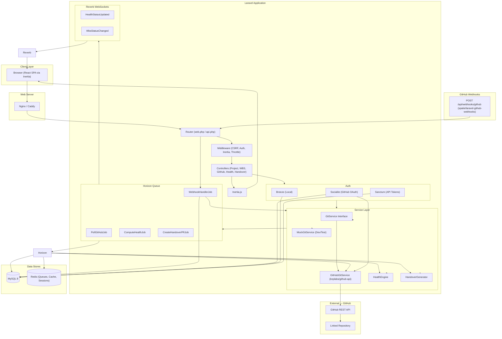
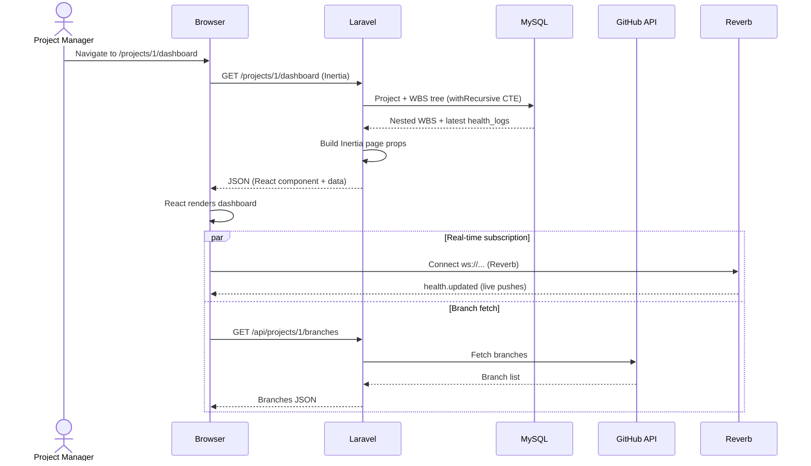
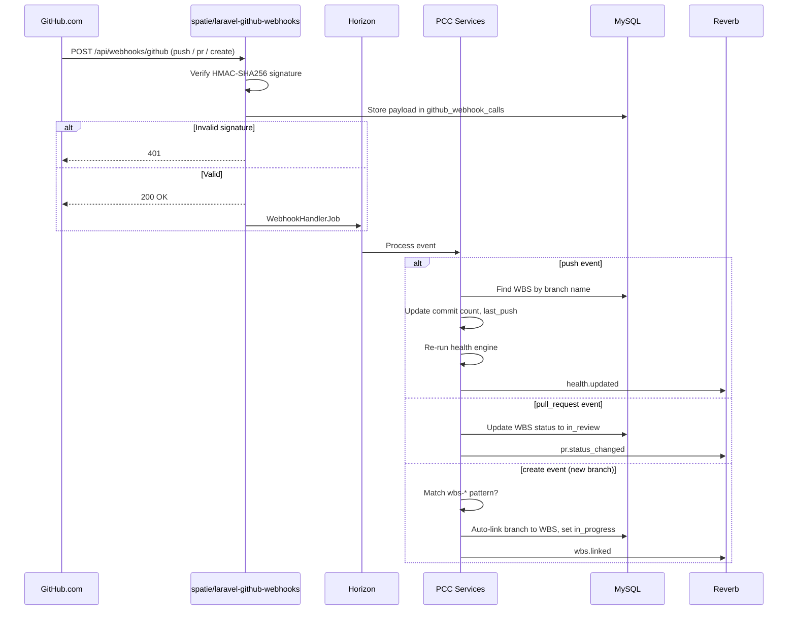
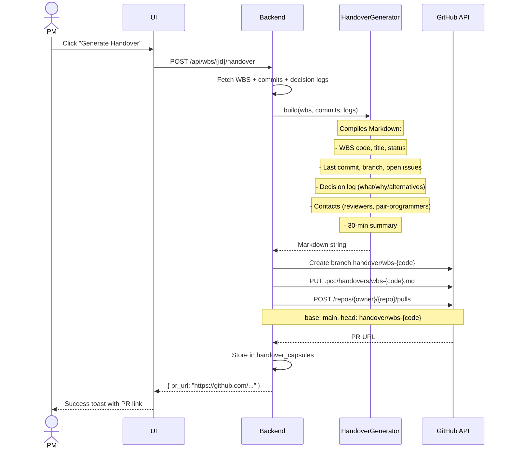
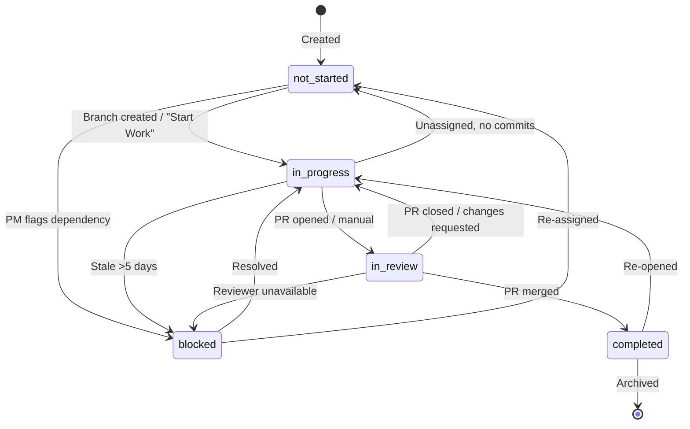
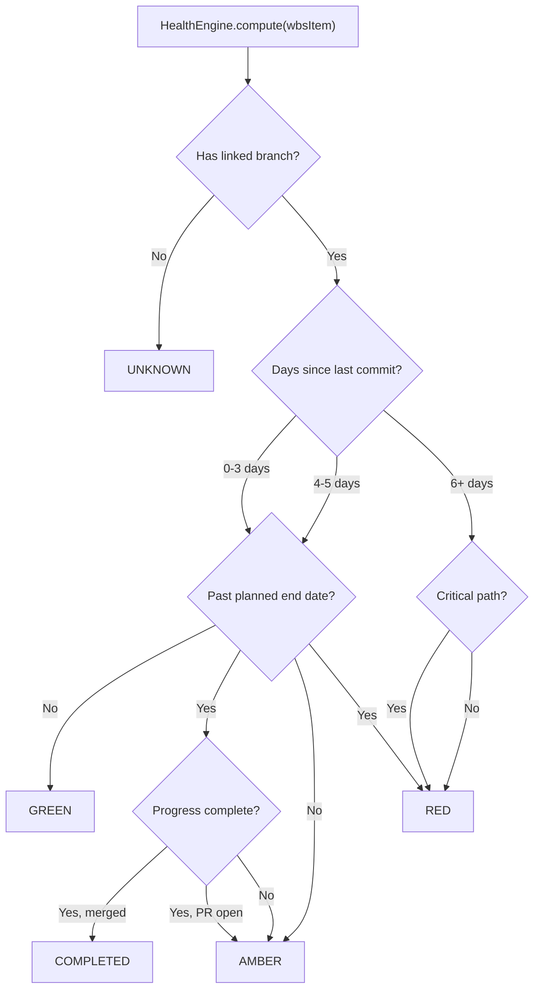
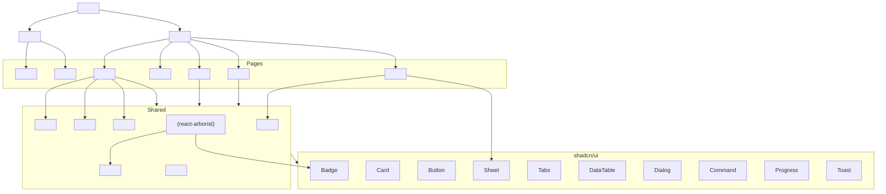

# PCC Architecture

> Project Command Center — System, Data, and Flow Architecture
>
> Stack: Laravel 12+ / Inertia + React + shadcn / MySQL 8 / Redis

---

## 1. Layered System Architecture



---

## 2. Entity Relationship Diagram (MySQL)

```mermaid
erDiagram
    USERS {
        bigint id PK
        string name
        string email UK
        timestamp email_verified_at
        string password
        string github_id UK
        string github_token "encrypted, nullable"
        string github_avatar "nullable"
        timestamps
    }

    PROJECTS {
        bigint id PK
        bigint owner_id FK
        string name
        string description
        string github_repo "nullable"
        string github_owner "nullable"
        string github_webhook_secret "encrypted, nullable"
        json baseline_snapshot "nullable"
        enum status "active|archived"
        timestamps
    }

    WORK_PACKAGES {
        bigint id PK
        bigint project_id FK
        bigint parent_id FK "nullable, self-ref"
        string wbs_code "e.g. 1.2.3"
        string title
        text description "nullable"
        bigint assignee_id FK "nullable"
        enum status "not_started|in_progress|in_review|completed|blocked"
        date planned_start
        date planned_end
        int estimated_hours "nullable"
        string linked_branch "nullable"
        int sort_order
        timestamps
        soft_deletes
    }

    HEALTH_LOGS {
        bigint id PK
        bigint work_package_id FK
        enum status "green|amber|red"
        text reason "nullable"
        json metrics "commit_count, days_since_last_commit, etc"
        timestamp checked_at
        timestamps
    }

    HANDOVER_CAPSULES {
        bigint id PK
        bigint work_package_id FK
        bigint generated_by FK
        text content "markdown body"
        string pr_url "nullable"
        string pr_branch "nullable"
        timestamp generated_at
        timestamps
    }

    GITHUB_WEBHOOK_CALLS {
        bigint id PK
        string event_type "push|pull_request|create"
        string action "nullable"
        json payload
        enum status "pending|processed|failed"
        timestamps
    }

    PROJECT_MEMBERS {
        bigint id PK
        bigint project_id FK
        bigint user_id FK
        enum role "admin|pm|developer|viewer"
        timestamps
        UK (project_id, user_id)
    }

    DECISION_LOGS {
        bigint id PK
        bigint project_id FK
        bigint work_package_id FK "nullable"
        string title
        text content
        string source "pr_comment|manual|meeting"
        string source_url "nullable"
        timestamps
    }

    NOTIFICATIONS {
        bigint id PK
        bigint user_id FK
        string type "health_alert|handover_ready|pr_created|wbs_assigned"
        json data
        timestamp read_at "nullable"
        timestamps
    }

    PERSONAL_ACCESS_TOKENS {
        bigint id PK
        bigint tokenable_id FK
        string name
        string token UK
        json abilities "nullable"
        timestamp last_used_at "nullable"
        timestamps
    }

    USERS ||--o{ PROJECTS : owns
    USERS ||--o{ PROJECT_MEMBERS : member_of
    USERS ||--o{ WORK_PACKAGES : assigned
    USERS ||--o{ HANDOVER_CAPSULES : generates
    USERS ||--o{ NOTIFICATIONS : receives
    USERS ||--o{ PERSONAL_ACCESS_TOKENS : has
    PROJECTS ||--o{ WORK_PACKAGES : contains
    PROJECTS ||--o{ PROJECT_MEMBERS : has
    PROJECTS ||--o{ DECISION_LOGS : has
    PROJECTS ||--o{ GITHUB_WEBHOOK_CALLS : receives
    WORK_PACKAGES ||--o{ WORK_PACKAGES : parent
    WORK_PACKAGES ||--o{ HEALTH_LOGS : evaluated_by
    WORK_PACKAGES ||--o{ HANDOVER_CAPSULES : has
    WORK_PACKAGES ||--o{ DECISION_LOGS : references
```

---

## 3. MySQL Schema — Key Indexes

| Table | Index | Type | Columns |
|---|---|---|---|
| `users` | `uk_users_email` | UNIQUE | `email` |
| `users` | `uk_users_github_id` | UNIQUE | `github_id` |
| `projects` | `idx_projects_owner` | INDEX | `owner_id` |
| `projects` | `idx_projects_status` | INDEX | `status` |
| `work_packages` | `idx_wbs_project` | INDEX | `project_id` |
| `work_packages` | `idx_wbs_parent` | INDEX | `parent_id` |
| `work_packages` | `idx_wbs_assignee` | INDEX | `assignee_id` |
| `work_packages` | `idx_wbs_status` | INDEX | `status` |
| `work_packages` | `idx_wbs_code` | INDEX | `(project_id, wbs_code)` |
| `work_packages` | `idx_wbs_branch` | INDEX | `(project_id, linked_branch)` |
| `work_packages` | `idx_wbs_sort` | INDEX | `(project_id, sort_order)` |
| `health_logs` | `idx_hl_wbs_checked` | INDEX | `(work_package_id, checked_at)` |
| `health_logs` | `idx_hl_status` | INDEX | `status` |
| `handover_capsules` | `idx_hc_generated` | INDEX | `generated_at` |
| `github_webhook_calls` | `idx_wh_event` | INDEX | `(event_type, status)` |
| `project_members` | `uk_member` | UNIQUE | `(project_id, user_id)` |

**WBS Tree Query** (adjacency list + recursive CTE):

```sql
WITH RECURSIVE wbs_tree AS (
    SELECT id, parent_id, wbs_code, title, status, sort_order, 1 AS depth
    FROM work_packages
    WHERE project_id = ? AND parent_id IS NULL
    UNION ALL
    SELECT wp.id, wp.parent_id, wp.wbs_code, wp.title, wp.status, wp.sort_order, wt.depth + 1
    FROM work_packages wp
    INNER JOIN wbs_tree wt ON wp.parent_id = wt.id
)
SELECT * FROM wbs_tree
ORDER BY depth, sort_order;
```

---

## 4. Request Flow — Dashboard Load



---

## 5. Webhook Processing



---

## 6. Handover Capsule as Pull Request



---

## 7. Work Package State Machine



---

## 8. Health Engine Rules



**Heuristic pseudocode:**

```
IF no linked branch        -> UNKNOWN (grey)
IF commits in last 3 days  -> GREEN (active)
IF no commits in 3-5 days  -> AMBER (stale, not critical)
    AND past deadline       -> RED (stale AND overdue)
IF no commits in 6+ days   -> RED (stale)
    AND critical path       -> RED + PM notification
IF branch merged            -> COMPLETED (green + update status)
```

---

## 9. Component Tree (React/Inertia)



---

## 10. Package Map

| Layer | Package | Purpose |
|---|---|---|
| Auth (local) | `laravel/breeze` | Login, register, password reset, profile |
| Auth (OAuth) | `laravel/socialite` | GitHub OAuth |
| API auth | `laravel/sanctum` | Token-based API auth |
| GitHub API | `graham-campbell/github` | Bridge for knplabs/github-api |
| GitHub API core | `knplabs/github-api` | PHP GitHub REST + GraphQL client |
| Webhooks | `spatie/laravel-github-webhooks` | Receive and verify GitHub webhooks |
| Queues | `laravel/horizon` | Dashboard and config for Redis queues |
| Real-time | `laravel/reverb` | WebSocket server |
| Debug (dev) | `laravel/telescope` | Queries, jobs, webhooks debug |
| Components | `shadcn/ui` | Radix + Tailwind components |
| Tree widget | `react-arborist` | Drag-and-drop WBS tree |
| Icons | `lucide-react` | Icon set |
| CSS | `tailwindcss` v4 | Utility-first CSS |
| SPA bridge | `inertiajs/inertia-laravel` + `@inertiajs/react` | Server-driven SPA |

---

## 11. Directory Structure

```
pcc/
├── app/
│   ├── Http/
│   │   ├── Controllers/
│   │   │   ├── ProjectController.php
│   │   │   ├── WbsController.php
│   │   │   ├── GitHubController.php
│   │   │   ├── HealthController.php
│   │   │   └── HandoverController.php
│   │   └── Middleware/HandleInertiaRequests.php
│   ├── Models/
│   │   ├── Project.php
│   │   ├── WorkPackage.php
│   │   ├── HealthLog.php
│   │   └── HandoverCapsule.php
│   ├── Services/
│   │   ├── Git/
│   │   │   ├── Contracts/GitService.php
│   │   │   ├── GitHubGitService.php
│   │   │   └── MockGitService.php
│   │   ├── HealthEngine.php
│   │   └── HandoverGenerator.php
│   ├── Jobs/
│   │   ├── PollGitHubJob.php
│   │   └── ComputeHealthJob.php
│   └── Events/
│       └── HealthStatusUpdated.php
├── database/
│   ├── migrations/
│   │   ├── 0001_create_users_table.php
│   │   ├── 0002_create_projects_table.php
│   │   ├── 0003_create_work_packages_table.php
│   │   └── 0004_create_health_logs_table.php
│   └── seeders/
│       └── MockProjectSeeder.php
├── resources/
│   ├── js/
│   │   ├── Pages/
│   │   │   ├── Dashboard.tsx
│   │   │   ├── Project/
│   │   │   │   ├── Create.tsx
│   │   │   │   ├── Show.tsx
│   │   │   │   ├── WbsEdit.tsx
│   │   │   │   └── Health.tsx
│   │   │   └── Auth/
│   │   └── Components/
│   │       ├── ui/ (shadcn generated)
│   │       ├── WbsTree.tsx
│   │       ├── HealthDot.tsx
│   │       ├── BranchPicker.tsx
│   │       └── HandoverCard.tsx
│   └── views/app.blade.php
├── routes/
│   ├── web.php
│   └── api.php
├── tests/
│   ├── Feature/
│   │   ├── ProjectTest.php
│   │   ├── WbsTest.php
│   │   ├── HealthTest.php
│   │   └── HandoverTest.php
│   └── Unit/
│       ├── HealthEngineTest.php
│       └── HandoverGeneratorTest.php
├── docker-compose.yml
├── Dockerfile
└── docs/
    └── architecture.md
```
